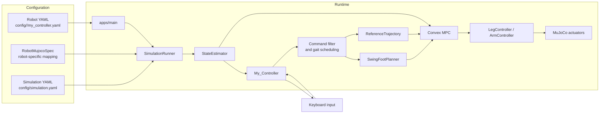

# convex-mpc-biped

A reusable humanoid locomotion stack for MuJoCo, built around convex MPC. It tracks reduced-body motion targets, plans swing-foot touchdowns, and turns contact plans into actuator torques for walking, standing balance, and in-place turning.

The controller is organized so new humanoid robots can be added without rewriting the core pipeline. Each robot contributes a MuJoCo model, a robot-specific spec, and a small YAML tuning layer; the locomotion stack stays shared.

## Quick start

1. Install the requirements below.
2. Set up MuJoCo and `vcpkg`.
3. Build from the repository root.
4. Launch the main binary with a robot selector and viewer flag.

```bash
cmake --preset dev
cmake --build --preset dev -j
./build/apps/main m y
```

## Requirements

- CMake 3.16 or newer
- A C++17 compiler
- `vcpkg`
- MuJoCo installed separately

Recommended local layout:

- `~/.local/vcpkg`
- `~/.local/mujoco`

Example macOS setup:

```bash
mkdir -p ~/.local
cd ~/.local
git clone https://github.com/microsoft/vcpkg.git
cd vcpkg
./bootstrap-vcpkg.sh
echo 'export VCPKG_ROOT="$HOME/.local/vcpkg"' >> ~/.zshrc
echo 'export PATH="$VCPKG_ROOT:$PATH"' >> ~/.zshrc
source ~/.zshrc
```

Install MuJoCo into `~/.local/mujoco`:

```bash
cd /path/to/workdir
git clone https://github.com/google-deepmind/mujoco.git
cd mujoco
git checkout 3.7.0
cmake -S . -B build -DCMAKE_INSTALL_PREFIX="$HOME/.local/mujoco"
cmake --build build -j
cmake --install build
```

Then configure and build:

```bash
cmake --preset dev
cmake --build --preset dev -j
```

If MuJoCo lives somewhere else, point `mujoco_DIR` in `CMakePresets.json` at that installation's `lib/cmake/mujoco` directory before configuring.

## Overview



## Repository layout

| Path | Purpose |
| --- | --- |
| `apps/` | Entry points and robot selection |
| `common/` | Shared data structures, estimator, math utilities, and keyboard input |
| `robot/` | Controller orchestration and torque aggregation |
| `sim/` | MuJoCo runner, robot bindings, and cheater-state reader |
| `My_Controller/` | Gait scheduler, touchdown planning, reference generation, MPC, and swing-foot tracking |
| `config/` | Robot-specific and simulation YAML configuration |
| `docs/` | Technical notes about frames, swing planning, and controller conventions |
| `test/` | Manual experiments and standing debug tools |

## Supported robots

| Robot | Status | Notes |
| --- | --- | --- |
| MIT Humanoid | Primary validation target | Best documented path and default example configuration |
| Unitree G1 | Supported | Uses robot-specific config in `config/unitree_robots/g1/` |
| Unitree H1 | Supported | Uses robot-specific config in `config/unitree_robots/h1/` |

## Usage

The main executable takes two arguments:

```bash
./build/apps/main <robot> <viewer>
```

Robot selection:

- `m`: MIT Humanoid
- `g`: Unitree G1
- `h`: Unitree H1

Viewer selection:

- `y`: open the MuJoCo viewer
- `n`: run headless

## Control modes

The walking or standing mode is selected in YAML, not from the keyboard.

Set `requested_locomotion_mode` in `config/<robot>/my_controller.yaml`:

- `walking`
- `standing`

Example:

```yaml
requested_locomotion_mode: walking
```

Change the YAML and restart the app to switch modes. The controller reads this value at startup and selects the matching keymap.

## Keyboard controls

### Walking mode

- `w / s`: forward / backward velocity
- `a / d`: left / right velocity
- `q / e`: yaw rate left / right
- `space`: clear the command

### Standing mode

- `up / down`: up / down velocity
- `i / k`: pitch forward / backward
- `j / l`: roll left / right
- `space`: clear the command

### Notes

- Keyboard commands are filtered before they reach the controller.
- Mode-specific commands are ignored when the other mode is active.
- The active walking limits for `x_dot`, `y_dot`, and `psi_dot` come from `user_command_filter` in YAML.

## Configuration

The main robot configuration lives in `config/<robot>/my_controller.yaml`.

Key fields:

- `requested_locomotion_mode`: startup mode, `walking` or `standing`
- `timing`: cycle, swing, stance, horizon length, and horizon steps
- `model`: MuJoCo model path and foot end-effector source
- `mpc`: contact model, weights, and solve cadence
- `swing`: touchdown planner gains, nominal offsets, and braking offset
- `user_command_filter`: command smoothing and max command limits
- `startup`: initial settle timing
- `logging`: standing MPC debug trigger times

The simulation-wide settings live in `config/simulation.yaml`.

## Adding a robot

The controller is intentionally structured to support new humanoid robots with a small integration surface.

To add a robot, prepare:

1. A robot YAML under `config/<robot>/` with the robot XML path, end-effector source, and tuning.
2. A `RobotMujocoSpec` implementation under `sim/src/models/` that maps bodies, foot links, contact sites, joints, and arms.
3. Robot assets in `models/` for the MuJoCo XML, URDF, meshes, and any related files.
4. Any robot-specific controller tuning in `config/<robot>/my_controller.yaml`.
5. If needed, runtime updates to register the new `RobotType` and its config path in `Types.h`, `robot/src/RobotConfig.cpp`, and `sim/src/models/RobotMujocoSpec.cpp`.

The existing examples are:

- `sim/src/models/MitHumanoidSpec.cpp`
- `sim/src/models/UnitreeG1Spec.cpp`
- `sim/src/models/UnitreeH1Spec.cpp`

## Notes

- `StateEstimator` is still cheater-state based.
- Headless runs continue until interrupted.
- Yaw control during in-place turning is still not robust enough and needs follow-up improvement.
