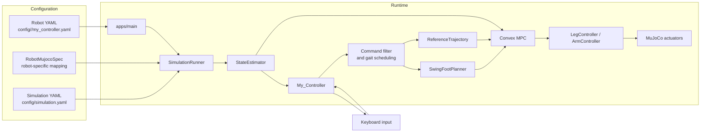
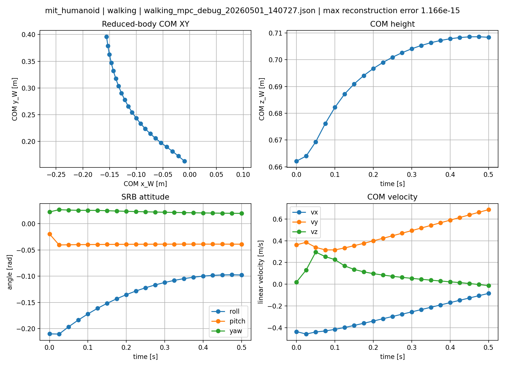
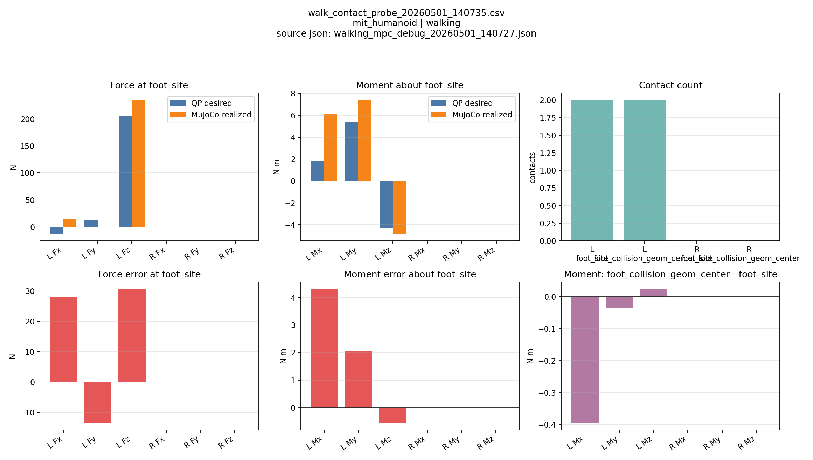
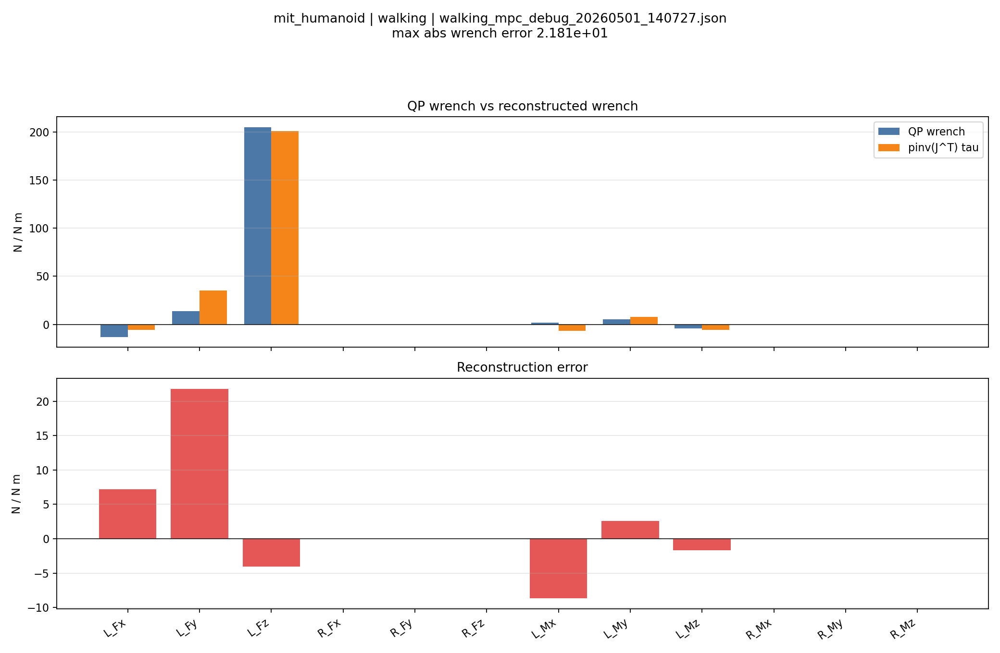
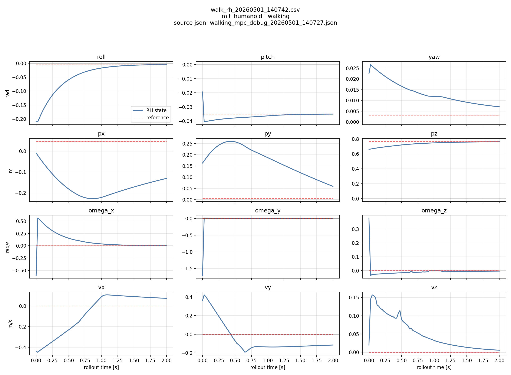

# convex-mpc-biped

A MuJoCo humanoid locomotion stack centered on a **Convex Model Predictive Controller (MPC)**. The control pipeline combines **Single Rigid Body (SRB)** modeling, **contact-wrench optimization**, heuristic **swing-foot planning** with additional touchdown rules, and explicit **early/late contact** handling to generate actuator torques for walking, standing balance, and in-place turning.

The same controller can be retargeted across robots through robot-specific MuJoCo models, kinematic/contact mappings, and YAML tuning, while the shared locomotion pipeline remains the same.

- **SRB-based Model Predictive Control**
- **Contact-wrench optimization** for feasible stance forces and moments
- **Heuristic swing-foot planning** with Raibert-style placement and touchdown heuristics
- **Early/late contact handling** for touchdown, liftoff, and recovery
- **Shared controller pipeline** across robots, with **viewer** and **headless** execution modes

<p align="center">
  
</p>

> [!TIP]
> Start with **Quick start** if you want the build path. Jump to **Debugging Probes**
> when you want logs, replay plots, and contact checks.

## Quick start

1. Install the requirements below.
2. Set up MuJoCo and `vcpkg`.
3. Build from the repository root.
4. Launch the main binary with a robot selector and viewer flag.

```bash
cmake --preset dev
cmake --build --preset dev -j
./build/apps/main m y
```

## Requirements

- CMake 3.16 or newer
- A C++17 compiler
- `vcpkg`
- MuJoCo installed separately

Recommended local layout:

- `~/.local/vcpkg`
- `~/.local/mujoco`

Example macOS setup:

```bash
mkdir -p ~/.local
cd ~/.local
git clone https://github.com/microsoft/vcpkg.git
cd vcpkg
./bootstrap-vcpkg.sh
echo 'export VCPKG_ROOT="$HOME/.local/vcpkg"' >> ~/.zshrc
echo 'export PATH="$VCPKG_ROOT:$PATH"' >> ~/.zshrc
source ~/.zshrc
```

Install MuJoCo into `~/.local/mujoco`:

```bash
cd /path/to/workdir
git clone https://github.com/google-deepmind/mujoco.git
cd mujoco
git checkout 3.7.0
cmake -S . -B build -DCMAKE_INSTALL_PREFIX="$HOME/.local/mujoco"
cmake --build build -j
cmake --install build
```

Then configure and build:

```bash
cmake --preset dev
cmake --build --preset dev -j
```

If MuJoCo lives somewhere else, point `mujoco_DIR` in `CMakePresets.json` at that installation's `lib/cmake/mujoco` directory before configuring.

## Overview



> [!IMPORTANT]
> The control frequencies below reflect the current checked-in defaults. Exact values come from each
> robot's `config/<robot>/my_controller.yaml` and from `config/simulation.yaml`.

### Control Frequencies

| Layer | Rate | Notes |
| --- | --- | --- |
| Physics integration | `0.002 s` / 500 Hz | MuJoCo step from `config/simulation.yaml` |
| Controller tick | 500 Hz | `SimulationRunner -> RobotRunner -> MyController::runController()` runs every simulation step |
| Contact manager | 500 Hz | Updates contact overrides and recovery state on each tick |
| Swing-foot planner | 500 Hz | Advances swing trajectories on each tick |
| MPC solve | 50 Hz | Rebuilds the QP every `iterations_between_solve = 10` physics steps |
| Reference trajectory | 50 Hz | Rebuilt whenever MPC is solved |

<details>
<summary><strong>Current robot timing defaults</strong></summary>

| Robot | Cycle | Swing | Stance | Horizon | Steps | `dt_mpc` |
| --- | ---: | ---: | ---: | ---: | ---: | ---: |
| MIT Humanoid | `0.5 s` | `0.15 s` | `0.35 s` | `0.5 s` | `25` | `20 ms` |
| Unitree G1 | `1.0 s` | `0.4 s` | `0.6 s` | `0.5 s` | `20` | `25 ms` |
| Unitree H1 | `1.0 s` | `0.4 s` | `0.6 s` | `0.5 s` | `20` | `25 ms` |

</details>

## Repository layout

| Path | Purpose |
| --- | --- |
| `apps/` | Entry points and robot selection |
| `common/` | Shared data structures, estimator, math utilities, and keyboard input |
| `robot/` | Controller orchestration and torque aggregation |
| `sim/` | MuJoCo runner, robot bindings, and cheater-state reader |
| `My_Controller/` | Gait scheduler, touchdown planning, reference generation, MPC, and swing-foot tracking |
| `config/` | Robot-specific and simulation YAML configuration |
| `docs/` | Technical notes about frames, swing planning, and controller conventions |
| `test/` | Manual experiments and standing debug tools |

## Supported robots

| Robot | Status | Notes |
| --- | --- | --- |
| MIT Humanoid | Primary validation target | Best documented path and default example configuration; the MIT MJCF and URDF are not distributed in this public repository |
| Unitree G1 | Supported | Uses robot-specific config in `config/unitree_robots/g1/` |
| Unitree H1 | Supported | Uses robot-specific config in `config/unitree_robots/h1/` |

## Usage

The main executable takes two arguments:

```bash
./build/apps/main <robot> <viewer>
```

Robot selection:

- `m`: MIT Humanoid
- `g`: Unitree G1
- `h`: Unitree H1

Viewer selection:

- `y`: open the MuJoCo viewer
- `n`: run headless

## Locomotion modes

> [!WARNING]
> `requested_locomotion_mode` is read at startup. Edit `config/<robot>/my_controller.yaml`
> and restart the app to switch between `walking` and `standing`.

Set `requested_locomotion_mode` in `config/<robot>/my_controller.yaml`:

- `walking`
- `standing`

Example:

```yaml
requested_locomotion_mode: walking
```

## Keyboard controls

### Walking mode

- `w / s`: forward / backward velocity
- `a / d`: left / right velocity
- `q / e`: yaw rate left / right
- `space`: clear the command

### Standing mode

- `up / down`: up / down velocity
- `i / k`: pitch forward / backward
- `j / l`: roll left / right
- `space`: clear the command

### Notes

- Keyboard commands are filtered before they reach the controller.
- Mode-specific commands are ignored when the other mode is active.
- The active walking limits for `x_dot`, `y_dot`, and `psi_dot` come from `user_command_filter` in YAML.

## Configuration

The main robot configuration lives in `config/<robot>/my_controller.yaml`.

Key fields:

- `requested_locomotion_mode`: startup mode, `walking` or `standing`
- `timing`: cycle, swing, stance, horizon length, and horizon steps
- `model`: MuJoCo model path and foot end-effector source
- `mpc`: contact model, weights, and solve rate
- `swing`: touchdown planner gains, nominal offsets, and braking offset
- `user_command_filter`: command smoothing and max command limits
- `startup`: initial settle timing
- `logging`: standing MPC debug trigger times

> [!NOTE]
> The config files are intentionally small and robot-specific. The shared controller code
> reads them at startup and keeps the runtime behavior in sync with the **YAML snapshot**
> that is also written into each MPC debug log.

The simulation-wide settings live in `config/simulation.yaml`.

## Debugging Workflow

The post-processing wrapper reads one MPC debug JSON and generates four diagnostics:
one single-solve SRB replay plus three probes for contact consistency, wrench
projection, and receding-horizon behavior.

Capture a log while the app is running:

- Press `Shift+L` once the robot is in the desired state.
- Or set `logging.standing_mpc_debug_trigger_times` in `config/<robot>/my_controller.yaml`
  to queue standing-mode logs at specific simulation times.
- Logs are written under `logs/debug/standing_mpc/` or `logs/debug/walking_mpc/`.

> [!WARNING]
> `Shift+L` queues a log for the next scheduled MPC solve, so the JSON is captured after
> the controller reaches that solve boundary.

Run the wrapper to generate the full set:

```bash
./scripts/run_mpc_debug.sh --standing -n 80
./scripts/run_mpc_debug.sh --walking -n 80
./scripts/run_mpc_debug.sh --all-latest -n 80
./scripts/run_mpc_debug.sh -l logs/debug/walking_mpc/walking_mpc_debug_20260501_140727.json -n 80
```

Each pass writes a **report**, a **CSV** where relevant, and the corresponding plot
artifacts under `logs/debug/{standing_mpc,walking_mpc}/...`.

### SRB reconstruction

This is a single-solve replay, not a fresh MPC solve. The script reads the logged
`x0`, `A_qp`, `B_qp`, and wrench horizon from the JSON, reconstructs the predicted
state horizon from that MPC solution, and plots the reconstruction against the
stored prediction. Use it to verify that the captured solve is internally
self-consistent.

<p align="center">
  
</p>

### Contact probe

This probe restores the logged MuJoCo state (`full_qpos`, `full_qvel`), applies the
recorded `full_tau_command`, runs `mj_forward`, and measures the realized contact
wrench about the same reference point used in the log. The plot compares the QP
desired wrench with the wrench MuJoCo actually realizes.

<p align="center">
  
</p>

### Wrench reconstruction

This analysis forms the leg-jacobian map `A` and projects the QP wrench through its
pseudoinverse, `w_rec = A^+ (A w_qp)`. The result is the row-space projection of the
desired wrench, so in the common two-5-DoF-leg case it shows which of the 6-D wrench
components fall outside the row space of the available leg Jacobians. If the log does
not contain `wrench_to_tau_jacobian`, the script rebuilds it from MuJoCo foot Jacobians.

<p align="center">
  
</p>

### Receding horizon

This is the closed-loop replay path. At every rollout step it rebuilds the reference
trajectory, gait constraints, SRB formulation, and QP, then advances from the first
state of the new solve. The output plots are `states.png`, `wrench.png`, and
`metrics.png`, which show state tracking, first-wrench evolution, and stability
metrics over time.

<p align="center">
  
</p>

> [!TIP]
> If you only need the latest log, `./scripts/run_mpc_debug.sh --all-latest -n 80`
> runs the full set in one shot.

## Adding a robot

The controller is intentionally structured to support new humanoid robots with a small integration surface.

To add a robot, prepare:

1. A robot YAML under `config/<robot>/` with the robot XML path, end-effector source, and tuning.
2. A `RobotMujocoSpec` implementation under `sim/src/models/` that maps bodies, foot links, contact sites, joints, and arms.
3. Robot assets in `models/` for the MuJoCo XML, URDF, meshes, and any related files.
4. Any robot-specific controller tuning in `config/<robot>/my_controller.yaml`.
5. If needed, runtime updates to register the new `RobotType` and its config path in `Types.h`, `robot/src/RobotConfig.cpp`, and `sim/src/models/RobotMujocoSpec.cpp`.

The existing examples are:

- `sim/src/models/MitHumanoidSpec.cpp`
- `sim/src/models/UnitreeG1Spec.cpp`
- `sim/src/models/UnitreeH1Spec.cpp`

## Notes

- **StateEstimator** is still cheater-state based.
- **Headless** runs continue until interrupted.
- **The MIT Humanoid MJCF and URDF are intentionally not shared in this public repository.**
- The Unitree G1 and H1 parameters in `config/unitree_robots/{g1,h1}/my_controller.yaml` are
  present, but they are **not fully tuned or validated** yet; treat them as starting points
  rather than final gains.
- Yaw control during in-place turning is still not robust enough and needs follow-up improvement.
