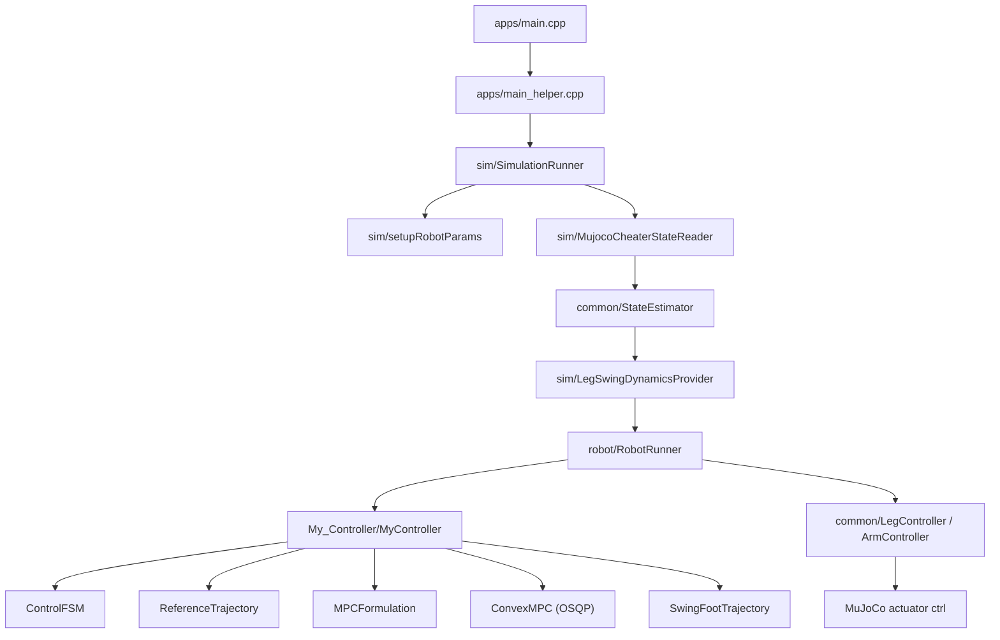

# ConvexMPC

MuJoCo 기반 휴머노이드 시뮬레이션 위에서 동작하는 보행 제어 프로젝트다. 현재 구조는 크게 다음 두 층으로 나뉜다.

1. `sim/`, `robot/`, `common/`
MuJoCo 모델 로드, 상태 읽기, 동역학 보조 계산, 저수준 토크 합성까지 담당한다.

2. `My_Controller/`
보행 주기 생성, 발 착지 위치 결정, SRB(single rigid body) 기반 MPC 정식화, QP 해석(OSQP), 스윙 발 궤적 생성을 담당한다.

현재 기본 실행 경로는 MIT Humanoid를 기준으로 가장 잘 연결되어 있고, Unitree G1/H1도 코드상 지원하도록 확장되어 있다.

## 한눈에 보는 흐름



## 프레임 표기

이 프로젝트는 frame 이름을 짧게 적고, 회전행렬과 위치벡터는 접미사로 기준을 드러낸다.

- `R_WT`: world 기준 torso frame
- `R_WB`: world 기준 SRB body frame, yaw-only virtual frame
- `R_BW`: `R_WB.transpose()`
- `p_WX`: world에서 본 위치
- `p_BX`: SRB body frame에서 본 위치

SRB body frame은 `torso + arms`의 reduced COM을 원점으로 하고, orientation은 torso heading의 yaw만 반영한다. `LegSwingDynamicsProvider`는 이 frame을 쓰지 않고 world frame 출력을 유지한다.

## 디렉터리 구조

```text
ConvexMPC/
├── apps/
│   ├── main.cpp
│   ├── main_helper.cpp
│   └── CMakeLists.txt
├── common/
│   ├── include/
│   │   ├── Controllers/
│   │   ├── Dynamics/
│   │   ├── Robot/
│   │   ├── StateEstimator/
│   │   ├── Utilities/
│   │   ├── SimulationIO.h
│   │   ├── Types.h
│   │   └── cppTypes.h
│   ├── src/
│   │   ├── Controllers/
│   │   ├── Dynamics/
│   │   ├── Estimator/
│   │   ├── Robot/
│   │   └── Utilities/
│   └── CMakeLists.txt
├── robot/
│   ├── include/robot/
│   ├── src/
│   └── CMakeLists.txt
├── sim/
│   ├── include/
│   │   ├── models/
│   │   └── sim/
│   ├── src/
│   │   ├── models/
│   │   └── ...
│   └── CMakeLists.txt
├── My_Controller/
│   ├── include/MyController/
│   ├── src/
│   └── CMakeLists.txt
├── config/
│   └── my_controller.yaml
├── models/
│   ├── mit_humanoid/
│   └── unitree_robots/
├── test/
│   ├── swinglegcontrol/
│   └── SwingTrajectory/
├── CMakeLists.txt
└── README.md
```

## 모듈별 역할

### `apps/`

- `main.cpp`
  - `MyController`를 생성하고 진입점을 호출한다.
- `main_helper.cpp`
  - CLI 인자를 해석해 어떤 로봇 모델을 띄울지 결정한다.
  - `SimulationRunner`를 생성하고 실행한다.

### `common/`

- `SimulationIO.h`
  - 시뮬레이터 상태(`CheaterState`, `RobotLegState`, `RobotArmState`)와 제어 출력(`RobotCommand`)의 공통 데이터 형식을 정의한다.
- `StateEstimator`
  - 현재는 `Cheater` 모드만 구현되어 있다.
  - MuJoCo에서 읽은 상태를 그대로 `StateEstimate`로 복사하고 yaw(`psi`)만 계산한다.
- `RobotModel`
  - 전신 벡터에서 leg/arm 인덱스를 분리해 읽고 쓰는 인덱싱 계층이다.
- `LegController`, `ArmController`
  - 관절 PD, 스윙 발 Cartesian 추종, stance wrench 변환을 담당한다.
- `OperationalSpaceDynamics`
  - Jacobian, 질량행렬을 이용해 스윙 발 작업공간 가속도/힘 명령을 관절 토크로 변환한다.
- `KeyboardCommand`
  - `w/s/a/d/q/e/space` 입력을 `UserCommand`로 누적한다.

### `robot/`

- `RobotRunner`
  - 제어 루프의 중간 조정자다.
  - 초기 자세 보간(`LegPosInitializer`, `ArmPosInitializer`)을 수행한 뒤 메인 컨트롤러를 호출한다.
  - `LegController`, `ArmController`가 만든 limb 토크를 전체 actuator 토크 벡터로 합친다.
- `LegPosInitializer`, `ArmPosInitializer`
  - 시작 직후 각 관절을 기본 자세(`default_qpos`)로 부드럽게 보내는 spline 초기화기다.

### `sim/`

- `SimulationRunner`
  - MuJoCo XML 로드, `mjData` 생성, viewer thread 관리, physics step 실행을 담당한다.
- `setupRobotParams`
  - MuJoCo 모델 이름을 기준으로 각 로봇의 joint/actuator/body binding을 만든다.
  - `RobotParams`와 `MujocoRobotBindings`를 채운다.
- `MujocoCheaterStateReader`
  - MuJoCo의 body pose, velocity, actuator force 등을 읽어 `CheaterState`를 만든다.
- `LegSwingDynamicsProvider`
  - 각 다리만 남긴 보조 MuJoCo 모델을 따로 만들어 스윙 발 Jacobian, Jacobian dot, 질량행렬, bias를 계산한다.
  - 출력은 world frame 기준으로 유지하고, SRB frame 변환은 상위 제어층에서 맡는다.
  - 이 값들이 `LegController`의 작업공간 스윙 제어에 사용된다.
- `main_thread`
  - MuJoCo의 `simulate.h` viewer 루프를 감싼다.
- `models/*Spec.cpp`
  - MIT/G1/H1 각각의 MuJoCo 이름 규약을 `RobotMujocoSpec`으로 고정한다.

### `My_Controller/`

- `ControllerConfig`
  - `config/my_controller.yaml`을 읽고 주기, horizon, 마찰계수, cost, swing gain 등을 전역 설정으로 제공한다.
- `HorizonClock`
  - 현재 보행 cycle 기준 시각 `t0`와 MPC 예측시점 `tk`를 생성한다.
- `GaitScheduler`
  - 좌/우 발의 stance/swing 위상을 결정한다.
  - 접촉 조건 제약행렬 `C`, swing leg equality 제약행렬 `D`를 만든다.
- `ControlFSM`
  - 사용자 속도 명령과 현재 COM 상태를 바탕으로 다음 touchdown 목표 위치를 계산한다.
- `ReferenceTrajectory`
  - horizon 전체에 대한 yaw, COM 위치/속도, 각 발 상대 위치 기준 궤적을 생성한다.
- `MPCFormulation`
  - 13차 상태, 12차 입력의 SRB 모델을 ZOH로 이산화하고 lifted prediction matrix `A_qp`, `B_qp`를 만든다.
- `ConvexMPC`
  - OSQP/OsqpEigen를 통해 QP를 구성하고 첫 스텝의 최적 wrench를 구한다.
- `SwingFootTrajectory`
  - stance에서 swing으로 넘어간 다리에 대해 부드러운 3D 발 궤적을 생성한다.
- `My_Controller`
  - 위 모듈을 엮는 최상위 보행 컨트롤러다.
  - stance 다리에는 최적 wrench를, swing 다리에는 Cartesian tracking 명령을 쓴다.

### `models/`

- `mit_humanoid/`
  - MIT 휴머노이드의 MuJoCo XML, URDF, mesh.
- `unitree_robots/`
  - G1, H1, Go2 계열 모델과 asset.
  - 이 프로젝트에서 실제 제어 경로는 주로 G1/H1 휴머노이드 파일을 사용한다.

### `test/`

- `test/swinglegcontrol/`
  - 보행 전체 대신 스윙 발 제어만 분리해 확인하는 실험용 실행 파일.
  - floating base를 고정한 뒤 각 다리에 `SwingFootTrajectory`를 반복 적용한다.
- `test/SwingTrajectory/`
  - MATLAB 기반 궤적 프로토타입 파일.
  - C++ 빌드에는 직접 연결되지 않는다.

## 제어 구조 상세

### 1. 초기화 단계

프로그램이 시작되면 `SimulationRunner`가 MuJoCo XML을 로드하고 `setupRobotParams()`로 로봇의 joint/actuator/body 이름을 내부 인덱스로 바꾼다. 이후 `RobotRunner`가 limb controller와 자세 초기화기들을 준비한다.

### 2. 매 시뮬레이션 스텝에서 하는 일

한 step마다 다음 순서로 흐른다.

1. `fillCheaterState()`가 MuJoCo 상태를 읽는다.
2. `StateEstimator`가 이를 `StateEstimate`로 변환한다.
3. `LegSwingDynamicsProvider`가 스윙 제어에 필요한 foot Jacobian/질량행렬/bias를 계산해 넣는다.
4. `RobotRunner`가 초기 자세 보간이 끝났는지 확인한다.
5. 초기화가 끝나면 `MyController::runController()`가 호출된다.
6. `MyController`는 gait phase를 업데이트하고 touchdown 목표 위치를 계산한다.
7. `ReferenceTrajectory`와 `MPCFormulation`이 예측 모델을 만든다.
8. `ConvexMPC`가 QP를 풀어 stance wrench를 구한다.
9. swing 다리는 `SwingFootTrajectory`를 따라가도록 Cartesian 명령을 만든다.
10. `LegController`, `ArmController`가 최종 actuator torque를 만든다.
11. `SimulationRunner`가 torque를 `data->ctrl`에 써 넣고 `mj_step()`을 호출한다.

### 3. MPC가 실제로 푸는 것

현재 구현은 전신 전체를 직접 최적화하지 않고, reduced-body 모델을 푼다.

- 상태 차원: 13
  - `[roll, pitch, yaw, com_x, com_y, com_z, wx, wy, wz, vx, vy, vz, g]`
- 입력 차원: 12
  - `[F_left(3), F_right(3), M_left(3), M_right(3)]`

즉, MPC는 "어떤 발 wrench를 써야 COM/자세가 원하는 궤적을 따르는가"를 푸는 구조다. 스윙 발 자세 추종은 별도의 작업공간 제어가 맡는다.

### 4. 왜 보조 MuJoCo 다리 모델이 필요한가

스윙 발 제어는 발 Jacobian, Jacobian dot, leg mass matrix, bias term이 필요하다. 이 프로젝트는 각 다리만 남긴 보조 MuJoCo 모델을 개별로 만들어 그 값을 계산한다. 그래서 메인 전신 모델의 상태를 읽는 부분과, 스윙 발 동역학을 계산하는 부분이 분리되어 있다.

## 설정 파일

메인 설정은 `config/my_controller.yaml`에 있다.

- `timing`
  - 보행 cycle, swing/stance 시간, MPC horizon 길이와 step 수
- `model`
  - 중력
- `mpc`
  - 마찰계수, 발 접촉영역 크기, 정상력 상한/하한, 상태/입력 cost, MPC solve 주기
- `swing`
  - 스윙 발 tracking gain, 발 들어올림 높이
- `foot_placement`
  - 속도 피드백 기반 touchdown 위치 보정 항
- `logging`
  - gait 상태 출력 간격

코드에서는 `R_WT`, `R_WB`, `p_W`, `p_B`처럼 frame을 접미사로 표시해서, world/torso/SRB body 기준이 섞이지 않게 맞추는 편이 좋다.

이 파일을 바꾸면 README 기준 현재 구현상 시뮬레이터를 재시작해야 반영된다.

## 빌드 방법

### 요구 의존성

- CMake 3.16+
- C++17 컴파일러
- Eigen3
- MuJoCo
- GLFW3
- OSQP
- OsqpEigen
- yaml-cpp

현재 CMake 코드는 경로를 하드코딩하지 않고 표준 `find_package()`만 사용한다. 로컬 개발 환경에서는 `CMakePresets.json`이 아래 prefix를 `CMAKE_PREFIX_PATH`에 추가해준다.

- `~/.local/mujoco`
- `~/.local/osqp`
- `~/.local/osqp-eigen`
- `~/.local/yaml-cpp`

가장 간단한 빌드 방법은 preset을 쓰는 것이다.

`CMakePresets.json`을 쓰려면 CMake 3.21+가 필요하다.

```bash
cmake --preset dev
cmake --build --preset dev -j
```

다른 위치에 설치돼 있다면 `CMAKE_PREFIX_PATH` 또는 각 패키지의 `*_DIR`를 직접 넘기면 된다.

```bash
cmake -S . -B build \
  -DCMAKE_PREFIX_PATH="/path/to/mujoco;/path/to/osqp;/path/to/osqp-eigen;/path/to/yaml-cpp"

cmake --build build -j
```

## 실행 방법

### 메인 시뮬레이션

```bash
./build/apps/main m y
./build/apps/main m n
./build/apps/main g y
./build/apps/main h n
```

- 첫 번째 인자
  - `m`: MIT humanoid
  - `g`: Unitree G1
  - `h`: Unitree H1
- 두 번째 인자
  - `y`: viewer 사용
  - `n`: headless

### 키보드 명령

TTY 환경에서만 동작한다.

- `w / s`: 전후 속도 명령
- `a / d`: 좌우 속도 명령
- `q / e`: yaw rate 명령
- `space`: 명령 초기화

### 스윙 발 실험 실행기

```bash
./build/test/swinglegcontrol/main_swing_test m y
./build/test/swinglegcontrol/main_swing_test m n
```

이 바이너리는 fixed-base 상태에서 스윙 발 추종만 따로 보는 데 목적이 있다.

## 현재 코드 기준 주의사항

### 1. H1 CLI 인자 처리 불일치

`main_helper.cpp`는 내부 분기에서는 `h`를 지원하지만, 인자 개수가 2개일 때는 `m`과 `g`만 허용한다. 따라서 H1은 현재 코드상 `./build/apps/main h`처럼 실행하면 실패하고, `./build/apps/main h y` 또는 `h n`처럼 실행하는 것이 안전하다.

### 2. Headless 실행은 자동 종료되지 않음

viewer 없는 실행은 현재 의도적으로 내부 종료 조건 없이 계속 루프를 돈다. 개인 확인용 실행에는 편하지만, 자동화된 회귀 테스트용으로는 별도 종료 조건이나 step limit이 필요하다.

### 3. `main_swing_test`는 수동 확인용이다

`test/swinglegcontrol` 실행 파일은 수동 확인용이라 `CTest`에 등록하지 않았다.

### 4. estimator는 현재 cheater only

비치터 추정기는 인터페이스만 있고 구현은 없다. 실제 로봇 연결이나 센서 기반 추정으로 확장하려면 `StateEstimatorMode::Estimated` 경로를 채워야 한다.

## 검토하면서 확인한 현재 상태

- `My_Controller` 경로 기준으로 빌드 정의를 통일했다.
- 상태 읽기와 스윙 발 동역학 보조 계산에서 반복 임시 버퍼 할당을 제거했다.
- `ReferenceTrajectory`, `MPCFormulation`, `ConvexMPC`는 MPC solve마다 결과 버퍼를 재사용하도록 정리했다.
- SRB 이산화는 일반 행렬지수 대신 현재 모델에 맞는 exact closed-form ZOH로 바꿨다.
- 사용되지 않던 `SimViewer` 보조 클래스를 제거하고 viewer 경로를 `MainThread` 하나로 정리했다.
