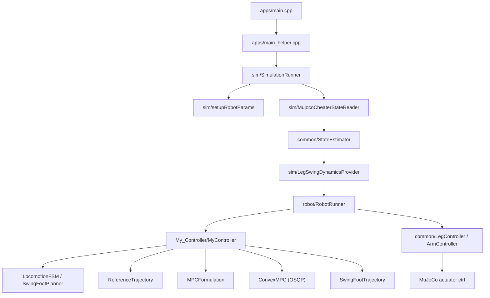

# ConvexMPC

ConvexMPC is a MuJoCo-based humanoid locomotion controller. `sim/`, `robot/`, and `common/` handle model loading, state estimation, auxiliary dynamics, and low-level torque synthesis. `My_Controller/` builds gait timing, touchdown targets, a reduced-body SRB MPC, and swing-foot tracking. MIT Humanoid is the primary validated path; Unitree G1 and H1 are supported in code.

## Overview



## Frame Conventions

- `W`: simulation world frame.
- `T`: robot MJCF root floating body frame, i.e. the base body used as the robot pose reference.
  - For MIT humanoid this is the `torso` body.
  - For Unitree G1 this is the `pelvis` body.
- `B`: yaw-aligned reduced-body COM frame.

The code suffixes vectors and matrices with their frame, for example `R_WT`, `R_WB`, `p_W`, and `p_B`, so the reference frame stays explicit.

`B` is a bookkeeping frame for the centroidal controller. It is used to express the reduced-body COM offset and inertia, not to define a full 6D rigid-body pose. The controller currently uses a mixed reduced-body state:

- orientation: torso roll/pitch/yaw
- position: reduced-body COM position in world, `p_com_W`
- angular velocity: torso angular velocity as the reduced-body rate estimate
- linear velocity: reduced-body COM velocity
- gravity: scalar `g`

In other words, the current MPC state mixes quantities from `T` and `B`: orientation and angular velocity are read from the floating base body `T`, while position and linear velocity are taken from the reduced-body COM model `B`. Because the upper body is held close to a rigid lump by the internal PD loops, treating it as a rigid body is a reasonable approximation for the current controller.

If `initial_pose.base_position_W` and `initial_pose.base_rpy_W` are provided in `my_controller.yaml`, the first `_bodyTarget` seed is computed from that floating-base pose and converted to the reduced-body COM target once at initialization. The same `initial_pose` block also controls the leg/arm initial pose interpolation durations via `leg_initialization_time` and `arm_initialization_time` in seconds.

This is a reduced-body SRB state, not a torso-origin MPC state. The reduced-body COM and inertia are recomputed from the current robot pose, so the model is posture-dependent.

## Repository Layout

- `apps/`: entry point and CLI selection of robot type.
- `common/`: shared data structures, estimator, controllers, and math utilities.
- `robot/`: controller orchestration and torque aggregation.
- `sim/`: MuJoCo runner, robot bindings, cheater-state reader, and leg-dynamics helper. The standing-only path skips unnecessary per-leg auxiliary models.
- `My_Controller/`: gait scheduler, reference trajectory, MPC formulation, QP solve, swing-foot trajectory, and debug logging.
- `models/`: MIT Humanoid and Unitree robot XML, URDF, and assets.
- `test/`: swing-hold tests, standing debug probes, and trajectory prototypes.

## Control Loop

1. `SimulationRunner` loads the MuJoCo model and robot bindings.
2. `MujocoCheaterStateReader` fills `CheaterState`.
3. `StateEstimator` builds `StateEstimate`.
4. `LegSwingDynamicsProvider` computes the swing-foot data needed by the current mode.
5. `RobotRunner` handles initial pose interpolation and torque aggregation.
6. `MyController` updates gait phase, touchdown targets, reference trajectories, and MPC.
7. `ConvexMPC` solves the stance-wrench QP.
8. `LegController` and `ArmController` synthesize the final actuator torques.
9. `SimulationRunner` writes `data->ctrl` and advances MuJoCo.

## MPC Model

The MPC uses a 13-state, 12-input reduced-body model:

- state: `[roll, pitch, yaw, com_x, com_y, com_z, omega_x, omega_y, omega_z, vx, vy, vz, g]`
- input: `[F_left(3), F_right(3), M_left(3), M_right(3)]`

The MPC optimizes stance wrenches. Swing-foot tracking is handled separately by the Cartesian leg controller.

## Configuration

`config/my_controller.yaml` controls:

- `timing`: cycle, swing, stance, horizon length, horizon steps
- `model`: gravity and MuJoCo model paths
- `mpc`: friction, contact wrench model, state/input weights, and solve cadence
- `swing`: swing gains and end-effector source
- `foot_placement`: touchdown heuristics
- `logging`: gait status and standing MPC debug triggers

`config/simulation.yaml` controls simulation runtime settings:

- `physics_timestep_sec`: MuJoCo simulation timestep
- `physics_integrator`: MuJoCo integrator mode (`euler`, `rk4`, `implicit`, `implicitfast`)
- `viewer_sync_hz`: how often physics state is pushed into the MuJoCo viewer

Standing debug logs record a serialized `controller_config` snapshot plus the runtime model/state needed for replay. The MPC weights are stored as YAML-style diagonal arrays, and `robot_type` is recorded for plot/report labels. Probe behavior is documented in `test/standing_debug/README.md`.

## Build

Dependencies:

- CMake 3.16+
- C++17 compiler
- Eigen3
- MuJoCo
- GLFW3
- OSQP
- OsqpEigen
- yaml-cpp

Recommended build:

```bash
cmake --preset dev
cmake --build --preset dev -j
```

If you install dependencies elsewhere, pass `CMAKE_PREFIX_PATH` or package-specific `*_DIR` values:

```bash
cmake -S . -B build \
  -DCMAKE_PREFIX_PATH="/path/to/mujoco;/path/to/osqp;/path/to/osqp-eigen;/path/to/yaml-cpp"

cmake --build build -j
```

## Run

Main simulation:

```bash
./build/apps/main m y
./build/apps/main m n
./build/apps/main g y
./build/apps/main h n
```

`m` selects MIT Humanoid, `g` selects Unitree G1, and `h` selects Unitree H1. `y` opens the viewer and `n` runs headless.

Keyboard commands:

- `w / s`: forward/backward velocity
- `a / d`: lateral velocity
- `q / e`: yaw rate
- `space`: clear the command

Gait swing hold tests:

```bash
./build/test/gait_swing_hold/main_gait_swing_hold_test m y
./build/test/gait_swing_hold/main_gait_swing_hold_test m n
```

The first test family isolates gait-scheduled swing/hold behavior for both legs. The standing debug tools are documented in `test/standing_debug/README.md`.

## Test Utilities

- `test/gait_swing_hold/`: manual gait swing/hold experiments.
- `test/gait_swing_hold_keyboard/`: keyboard-driven gait swing/hold experiments.
- `test/standing_debug/`: standing MPC log replay, contact probes, and receding-horizon probes.
- `test/SwingTrajectory/`: MATLAB trajectory prototype files.

## Current Notes

- `StateEstimator` is still cheater-only.
- Headless runs currently keep stepping until interrupted.
