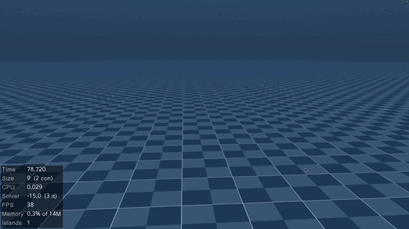
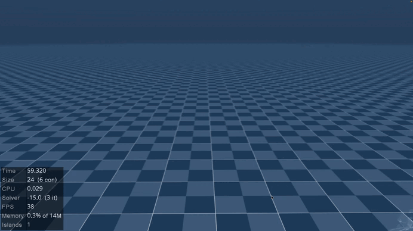
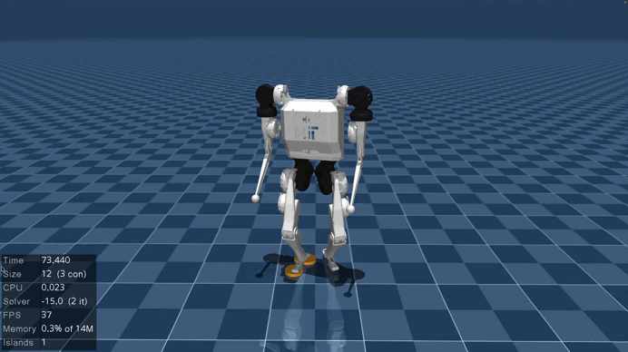
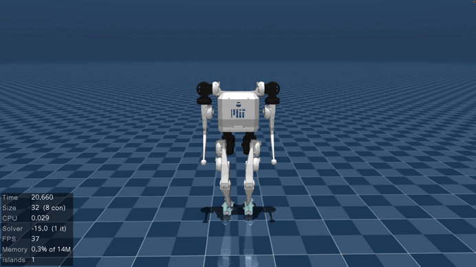
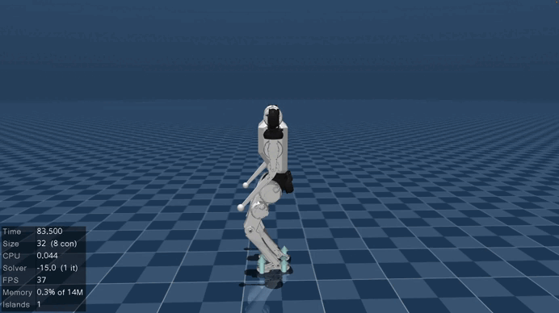
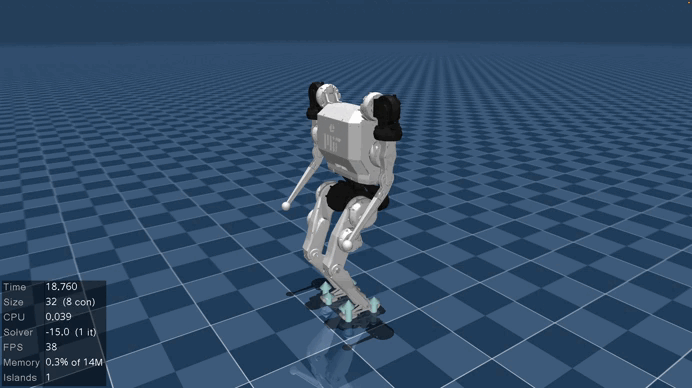
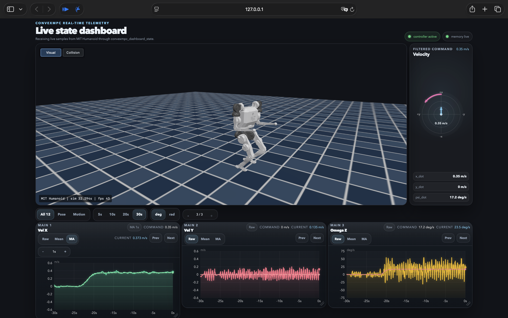
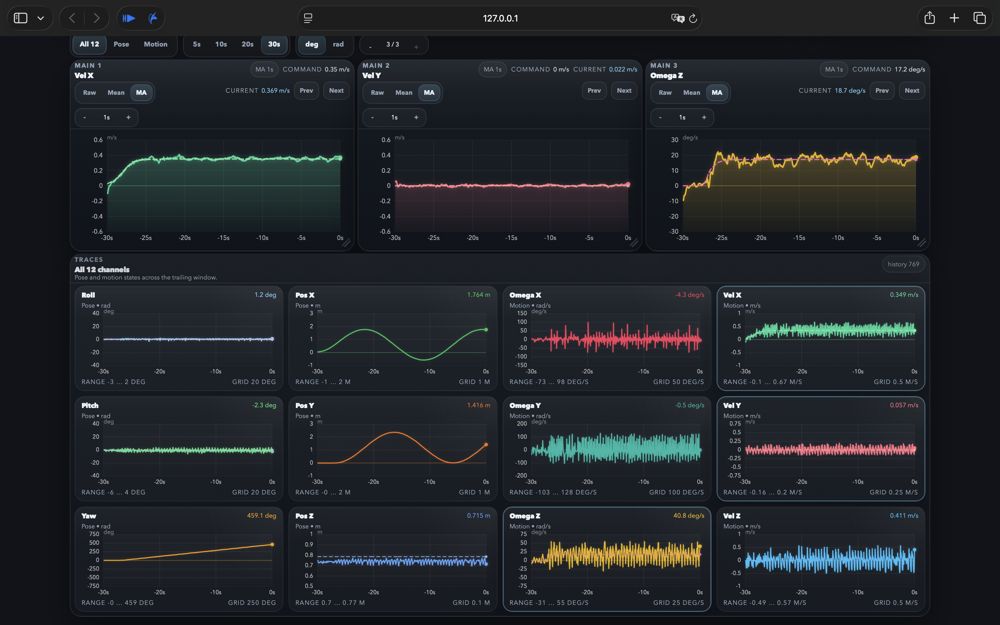
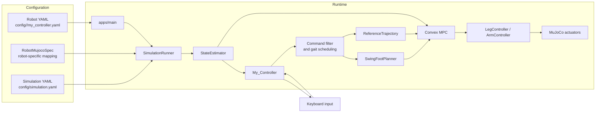
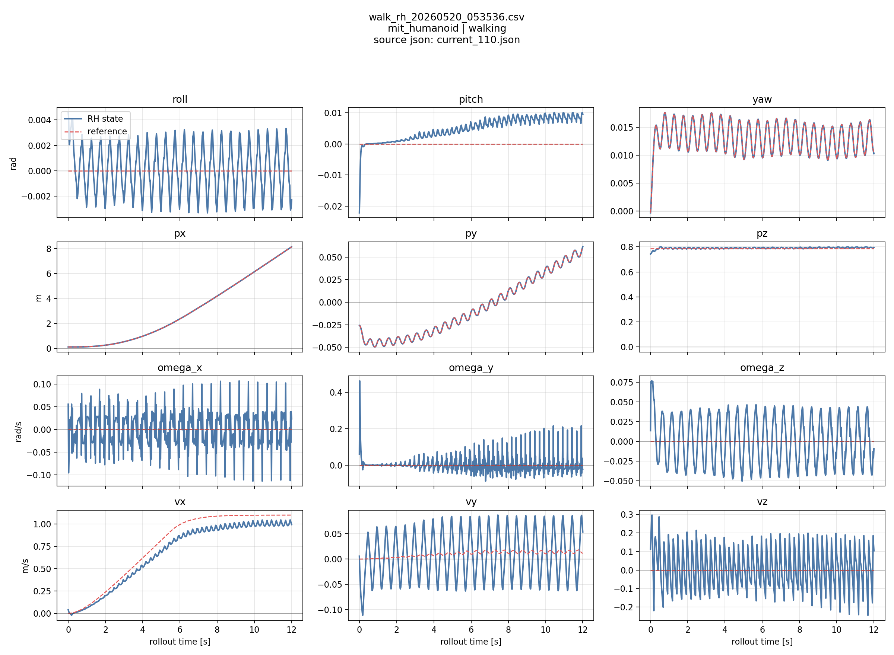

<!-- ╔══════════════════════════════════════════════════════════════════╗ -->
<!-- ║                        ANIMATED HEADER                             ║ -->
<!-- ╚══════════════════════════════════════════════════════════════════╝ -->

<a id="top"></a>

<p align="center">
  
</p>

<p align="center">
  <a href="https://github.com/ispaik06/convex-mpc-biped">
    
  </a>
</p>

<!-- Technology badges -->
<p align="center">
  
  
  
  
  
  
</p>

<!-- Navigation buttons -->
<p align="center">
  <a href="#quick-start"></a>
  <a href="#docs"></a>
  <a href="docs/web_dashboard.md"></a>
  <a href="#demos"></a>
</p>

<!-- Repository analytics badges -->
<p align="center">
  
  
  
  
  
</p>

---

<!-- ╔══════════════════════════════════════════════════════════════════╗ -->
<!-- ║                        DEMONSTRATIONS                              ║ -->
<!-- ╚══════════════════════════════════════════════════════════════════╝ -->

<a id="demos"></a>

<h2 align="center">◆ &nbsp;Demonstrations</h2>

<div align="center">

<table>
  <tr>
    <td align="center" width="33%">
      
      <br>
      <strong>Forward</strong>
      <br>
      <sub>Clip velocity: <code>0.6 m/s</code></sub>
    </td>
    <td align="center" width="33%">
      
      <br>
      <strong>Lateral</strong>
      <br>
      <sub>Clip velocity: <code>0.3 m/s</code></sub>
    </td>
    <td align="center" width="33%">
      
      <br>
      <strong>In-place Turn</strong>
      <br>
      <sub>Clip yaw rate: <code>1.3 rad/s</code></sub>
    </td>
  </tr>
  <tr>
    <td align="center" width="33%">
      
      <br>
      <strong>Roll</strong>
      <br>
      <sub>Base orientation tracking</sub>
    </td>
    <td align="center" width="33%">
      
      <br>
      <strong>Pitch</strong>
      <br>
      <sub>Base orientation tracking</sub>
    </td>
    <td align="center" width="33%">
      
      <br>
      <strong>Height</strong>
      <br>
      <sub>Base height tracking</sub>
    </td>
  </tr>
</table>

<br>


<br>
<sub>Combined locomotion demo &mdash; MIT Humanoid</sub>

<br>
<br>

<table>
  <tr>
    <td align="center" width="50%">
      
    </td>
    <td align="center" width="50%">
      
    </td>
  </tr>
</table>

<sub>Web dashboard: telemetry plots, command compass, and MuJoCo WASM viewer. See <a href="docs/web_dashboard.md">Web Dashboard</a> for setup and implementation details.</sub>

</div>

---

<!-- ╔══════════════════════════════════════════════════════════════════╗ -->
<!-- ║                            ABOUT                                   ║ -->
<!-- ╚══════════════════════════════════════════════════════════════════╝ -->

## ◆ &nbsp;About the Project

A **MuJoCo humanoid locomotion stack** centered on a **Convex Model Predictive Controller (MPC)** over a **Single Rigid Body (SRB)** model. The MPC optimizes stance **contact wrenches**; heuristic **swing-foot planning** with additional touchdown rules and explicit **early/late contact** handling turn that plan into actuator torques for **walking**, **standing balance**, and **in-place turning**.

One shared controller pipeline is **retargeted across robots** (MIT Humanoid, Unitree G1/H1) through robot-specific MuJoCo models, kinematic/contact mappings, and YAML tuning, while the core locomotion logic stays the same.

<table>
  <tr>
    <td width="50%" valign="top">

**Engineering focus**

- SRB-based convex MPC over a stance-wrench horizon
- Contact-wrench optimization for feasible forces &amp; moments
- Raibert-style swing-foot planning with touchdown heuristics
- Early / late contact, liftoff, and recovery handling

    </td>
    <td width="50%" valign="top">

**Systems mindset**

- Config-driven pipeline, one codebase, many robots
- Viewer &amp; headless execution modes
- Browser telemetry dashboard + MuJoCo WASM viewer
- Reproducible MPC debug &amp; replay workflow

    </td>
  </tr>
</table>

> [!TIP]
> New here? Jump to **[Quick Start](#quick-start)** for the build path, or **[Diagnostics](#diagnostics)** for logs, replay plots, and contact checks.

---

<!-- ╔══════════════════════════════════════════════════════════════════╗ -->
<!-- ║                          TECH STACK                                ║ -->
<!-- ╚══════════════════════════════════════════════════════════════════╝ -->

## ◆ &nbsp;Tech Stack

<div align="center">


<br>
<br>

**Control &amp; Math**


<br>

**Tooling &amp; I/O**


</div>

---

<!-- ╔══════════════════════════════════════════════════════════════════╗ -->
<!-- ║                    CONTROL STACK AT A GLANCE                       ║ -->
<!-- ╚══════════════════════════════════════════════════════════════════╝ -->

## ◆ &nbsp;Control Stack at a Glance

| Domain | Component | Details |
| --- | --- | --- |
| **Model** | Single Rigid Body (SRB) | Reduced-order body dynamics with contact wrenches as decision variables |
| **Optimization** | Convex MPC · OSQP | QP over a stance-wrench horizon, solved at **50 Hz**, with warm-start and sparse-constraint paths |
| **Swing** | `SwingFootPlanner` | Raibert-style foothold placement + touchdown heuristics and braking offsets |
| **Contact** | `ContactManager` | Overlays scheduled vs. estimated contact; handles early/late touchdown, liftoff, and recovery |
| **Reference** | `ReferenceTrajectory` | Desired SRB horizon rebuilt from the current estimate on every solve |
| **Actuation** | `LegController` / `ArmController` | Maps the first optimal wrench to joint torques and tracks swing trajectories |
| **Estimation** | `StateEstimator` | Currently cheater-state from MuJoCo (a real estimator is future work) |

---

<!-- ╔══════════════════════════════════════════════════════════════════╗ -->
<!-- ║                          QUICK START                               ║ -->
<!-- ╚══════════════════════════════════════════════════════════════════╝ -->

<a id="quick-start"></a>

## ◆ &nbsp;Quick Start

```bash
cmake --preset dev            # configure (RelWithDebInfo -> build/)
cmake --build --preset dev -j # build
./build/apps/main m y         # run: <robot>=m (MIT Humanoid), <viewer>=y (GUI)
```

<div align="center">

`<robot>` &rarr; `m` MIT Humanoid · `g` Unitree G1 · `h` Unitree H1 &nbsp;&nbsp;|&nbsp;&nbsp; `<viewer>` &rarr; `y` MuJoCo GUI · `n` headless

</div>

<details>
<summary><b>▸ &nbsp;Requirements &amp; environment setup</b></summary>

<br>

**Requirements**

- CMake 3.16 or newer
- A C++17 compiler
- `vcpkg` (with `VCPKG_ROOT` set)
- MuJoCo installed separately

C++ dependencies (Eigen, glfw3, nlohmann-json, osqp, osqp-eigen, yaml-cpp) come from the vcpkg manifest (`vcpkg.json`).

Recommended local layout:

- `~/.local/vcpkg`
- `~/.local/mujoco`

**Example macOS setup**

```bash
mkdir -p ~/.local
cd ~/.local
git clone https://github.com/microsoft/vcpkg.git
cd vcpkg
./bootstrap-vcpkg.sh
echo 'export VCPKG_ROOT="$HOME/.local/vcpkg"' >> ~/.zshrc
echo 'export PATH="$VCPKG_ROOT:$PATH"' >> ~/.zshrc
source ~/.zshrc
```

Install MuJoCo into `~/.local/mujoco`:

```bash
cd /path/to/workdir
git clone https://github.com/google-deepmind/mujoco.git
cd mujoco
cmake -S . -B build -DCMAKE_INSTALL_PREFIX="$HOME/.local/mujoco"
cmake --build build -j
cmake --install build
```

If you need a specific MuJoCo version, check out the tag you want before configuring, for example `git checkout 3.7.0`.

Then configure and build:

```bash
cmake --preset dev
cmake --build --preset dev -j
```

If MuJoCo lives somewhere else, point `mujoco_DIR` in `CMakePresets.json` at that installation's `lib/cmake/mujoco` directory before configuring. The debug preset builds to `build/debug/`.

</details>

<details>
<summary><b>▸ &nbsp;Usage &amp; launch options</b></summary>

<br>

The main executable takes two arguments:

```bash
./build/apps/main <robot> <viewer>
```

For a single launcher that can start the controller and an optional Python dashboard, use:

```bash
./scripts/launch_convexmpc.sh <robot> <viewer>
```

When `dashboard/app.py` is present, the launcher starts it automatically on the first free dashboard port at or above `8001`, then opens the browser unless `CONVEXMPC_DASHBOARD_OPEN_BROWSER=0` is set. If you need a specific port, set `CONVEXMPC_DASHBOARD_PORT`.

To run the controller headless with the browser dashboard and embedded MuJoCo WASM viewer:

```bash
./scripts/launch_convexmpc.sh --web-viewer m n
```

See [Web dashboard](docs/web_dashboard.md) for the Python/Node requirements, standalone viewer mode, shared-memory streams, and implementation details.

**Robot selection** — `m`: MIT Humanoid · `g`: Unitree G1 · `h`: Unitree H1
**Viewer selection** — `y`: open the MuJoCo viewer · `n`: run headless

</details>

---

<!-- ╔══════════════════════════════════════════════════════════════════╗ -->
<!-- ║                    ARCHITECTURE & PIPELINE                         ║ -->
<!-- ╚══════════════════════════════════════════════════════════════════╝ -->

## ◆ &nbsp;Architecture



> [!IMPORTANT]
> The concrete values below describe the current **MIT Humanoid** checked-in tuning. Timing and MPC cadence are YAML-driven, so other robots should be treated as robot-specific tuning targets rather than validated defaults.

<details>
<summary><b>▸ &nbsp;Control frequencies &amp; gait timing</b></summary>

<br>

| Layer | Rate | Notes |
| --- | --- | --- |
| Physics integration | `0.002 s` / 500 Hz | MuJoCo step from `config/simulation.yaml` |
| Controller tick | 500 Hz | `SimulationRunner -> RobotRunner -> MyController::runController()` runs every simulation step |
| Contact manager | 500 Hz | Updates contact overrides and recovery state on each tick |
| Swing-foot planner | 500 Hz | Advances swing trajectories on each tick |
| MPC solve | 50 Hz | MIT default: rebuilds the QP every `iterations_between_solve = 10` physics steps |
| MPC horizon sample | `20 ms` / 50 Hz | MIT default: `timing.horizon = 0.5 s`, `timing.horizon_steps = 25` |
| Reference trajectory | 50 Hz | Rebuilt on each scheduled MPC solve |

**MIT Humanoid gait timing**

| Cycle | Swing | Stance | Horizon | Horizon steps | `dt_mpc` |
| ---: | ---: | ---: | ---: | ---: | ---: |
| `0.5 s` | `0.17 s` | `0.33 s` | `0.5 s` | `25` | `20 ms` |

Unitree G1 and H1 configs are kept as integration starting points. Their timing, weights, and contact parameters still need robot-specific fine tuning before they should be treated as validated defaults.

</details>

<details>
<summary><b>▸ &nbsp;Locomotion modes &amp; keyboard controls</b></summary>

<br>

> [!WARNING]
> `requested_locomotion_mode` is read at startup. Edit `config/<robot>/my_controller.yaml` and restart the app to switch between modes.

Set `requested_locomotion_mode` in `config/<robot>/my_controller.yaml`:

- `walking`
- `standing`
- `interactive` — start in standing and toggle walking / standing from the keyboard

```yaml
requested_locomotion_mode: interactive
```

**Walking mode**

- `w / s`: forward / backward velocity
- `a / d`: left / right velocity
- `q / e`: yaw rate left / right
- `up / down`: body height up / down
- `i / k`: pitch forward / backward
- `j / l`: roll left / right
- `t`: toggle walking / standing when `requested_locomotion_mode: interactive`
- `space`: clear the command

**Standing mode**

- `up / down`: up / down velocity
- `i / k`: pitch forward / backward
- `j / l`: roll left / right
- `t`: toggle walking / standing when `requested_locomotion_mode: interactive`
- `space`: clear the command

**Notes**

- Keyboard commands are filtered before they reach the controller.
- Walking mode treats planar `x_dot`, `y_dot`, and `psi_dot` as velocity commands. The MPC reference is rebuilt from the current estimated state on each solve, while height/roll/pitch remain pose offsets.
- Standing mode still ignores `w / s`, `a / d`, and `q / e`.
- `interactive` mode starts in standing, and `t` switches between walking and standing.
- Walking &rarr; standing first zeroes the command while keeping the walking gait active, then waits until the body has been slow for a few ticks before it starts counting touchdown events or a timeout.
- The active walking limits for `x_dot`, `y_dot`, and `psi_dot` come from `user_command_filter` in YAML.

</details>

<details>
<summary><b>▸ &nbsp;Configuration reference</b></summary>

<br>

The main robot configuration lives in `config/<robot>/my_controller.yaml`.

Key fields:

- `requested_locomotion_mode`: startup mode, `walking` or `standing`
- `timing`: cycle, swing, stance, horizon length, and horizon steps
- `model`: MuJoCo model path and foot end-effector source
- `mpc`: contact model, weights, and solve rate
- `swing`: touchdown planner gains, nominal offsets, and braking offset
- `user_command_filter`: command smoothing and max command limits
- `locomotion_transition`: settle speed / hold ticks, braking timeout, and touchdown count used when braking from walking to standing
- `startup`: initial settle timing
- `logging`: standing MPC debug trigger times

> [!NOTE]
> The config files are intentionally small and robot-specific. The shared controller code reads them at startup and keeps the runtime behavior in sync with the **YAML snapshot** that is also written into each MPC debug log.

The simulation-wide settings live in `config/simulation.yaml`.

</details>

---

<!-- ╔══════════════════════════════════════════════════════════════════╗ -->
<!-- ║                    DIAGNOSTICS & DEBUG WORKFLOW                    ║ -->
<!-- ╚══════════════════════════════════════════════════════════════════╝ -->

<a id="diagnostics"></a>

## ◆ &nbsp;Diagnostics &amp; MPC Debug Workflow

Capture a solve while the app is running — press `Shift+L` (queues a log for the next scheduled MPC solve) or set `logging.standing_mpc_debug_trigger_times` in YAML. Logs land under `logs/debug/{standing_mpc,walking_mpc}/` as JSON. The post-processing wrapper reads one MPC debug JSON and generates four diagnostics: a single-solve SRB replay plus three probes for contact consistency, wrench projection, and receding-horizon behavior.

```bash
./scripts/run_mpc_debug.sh --standing -n 80
./scripts/run_mpc_debug.sh --walking -n 80
./scripts/run_mpc_debug.sh --all-latest -n 80
./scripts/run_mpc_debug.sh -l logs/debug/walking_mpc/walking_mpc_debug_20260501_140727.json -n 80
./scripts/run_mpc_debug.sh --walking -n 120 --x-dot-final 0.7
```

<table>
  <tr>
    <td width="50%" valign="top">
      <h4 align="center">SRB reconstruction</h4>
      
      <sub>Single-solve replay. Reads the logged <code>x0</code>, <code>A_qp</code>, <code>B_qp</code>, and wrench horizon, reconstructs the predicted state horizon, and plots it against the stored prediction to verify the captured solve is internally self-consistent.</sub>
    </td>
    <td width="50%" valign="top">
      <h4 align="center">Contact probe</h4>
      
      <sub>Restores the logged MuJoCo state (<code>full_qpos</code>, <code>full_qvel</code>), applies the recorded <code>full_tau_command</code>, runs <code>mj_forward</code>, and compares the QP desired wrench with the wrench MuJoCo actually realizes.</sub>
    </td>
  </tr>
  <tr>
    <td width="50%" valign="top">
      <h4 align="center">Wrench reconstruction</h4>
      
      <sub>Forms the leg-Jacobian map <code>A</code> and projects the QP wrench through its pseudoinverse, <code>w_rec = A&#8314; (A w_qp)</code>, exposing which 6-D wrench components fall outside the row space of the available leg Jacobians.</sub>
    </td>
    <td width="50%" valign="top">
      <h4 align="center">Receding horizon</h4>
      
      <sub>Closed-loop replay. Rebuilds reference, gait constraints, walking foot targets, SRB formulation, and QP at every step. Outputs <code>states.png</code>, <code>wrench.png</code>, and <code>metrics.png</code> for tracking, first-wrench evolution, and stability metrics.</sub>
    </td>
  </tr>
</table>

> [!TIP]
> If you only need the latest log, `./scripts/run_mpc_debug.sh --all-latest -n 80` runs the full set in one shot.

---

<!-- ╔══════════════════════════════════════════════════════════════════╗ -->
<!-- ║                        SUPPORTED ROBOTS                            ║ -->
<!-- ╚══════════════════════════════════════════════════════════════════╝ -->

## ◆ &nbsp;Supported Robots

| Robot | Status | Notes |
| --- | --- | --- |
| **MIT Humanoid** | Primary validation target | Best-documented path and default example configuration; the MIT MJCF and URDF are **not** distributed in this public repository |
| **Unitree G1** | Supported | Uses robot-specific config in `config/unitree_robots/g1/` |
| **Unitree H1** | Supported | Uses robot-specific config in `config/unitree_robots/h1/` |

<details>
<summary><b>▸ &nbsp;Adding a new robot</b></summary>

<br>

The controller is intentionally structured to support new humanoid robots with a small integration surface. To add a robot, prepare:

1. A robot YAML under `config/<robot>/` with the robot XML path, end-effector source, and tuning.
2. A `RobotMujocoSpec` implementation under `sim/src/models/` that maps bodies, foot links, contact sites, joints, and arms.
3. Robot assets in `models/` for the MuJoCo XML, URDF, meshes, and any related files.
4. Any robot-specific controller tuning in `config/<robot>/my_controller.yaml`.
5. If needed, runtime updates to register the new `RobotType` and its config path in `Types.h`, `robot/src/RobotConfig.cpp`, and `sim/src/models/RobotMujocoSpec.cpp`.

Existing examples:

- `sim/src/models/MitHumanoidSpec.cpp`
- `sim/src/models/UnitreeG1Spec.cpp`
- `sim/src/models/UnitreeH1Spec.cpp`

</details>

---

<!-- ╔══════════════════════════════════════════════════════════════════╗ -->
<!-- ║                       REPOSITORY LAYOUT                            ║ -->
<!-- ╚══════════════════════════════════════════════════════════════════╝ -->

## ◆ &nbsp;Repository Layout

| Path | Purpose |
| --- | --- |
| `apps/` | Entry points and robot selection |
| `common/` | Shared data structures, estimator, math utilities, and keyboard input |
| `robot/` | Controller orchestration and torque aggregation |
| `sim/` | MuJoCo runner, robot bindings, and cheater-state reader |
| `My_Controller/` | Gait scheduler, touchdown planning, reference generation, MPC, and swing-foot tracking |
| `config/` | Robot-specific and simulation YAML configuration |
| `docs/` | Technical notes about frames, reference trajectories, gait scheduling, swing planning, and conventions |
| `test/` | Manual experiments and standing debug tools |

---

<!-- ╔══════════════════════════════════════════════════════════════════╗ -->
<!-- ║                         DOCUMENTATION                              ║ -->
<!-- ╚══════════════════════════════════════════════════════════════════╝ -->

<a id="docs"></a>

## ◆ &nbsp;Documentation

Deep technical notes live in `docs/` — read these before touching frame conventions or the MPC formulation.

| Document | What it covers |
| --- | --- |
| [Web dashboard](docs/web_dashboard.md) | Browser telemetry, command compass, draggable charts, and MuJoCo WASM viewer setup |
| [MPC frame convention](docs/mpc_frame_convention.md) | State, wrench, and frame conventions used by the MPC |
| [Reference trajectory](docs/reference_trajectory.md) | Desired body-state rollout and command integration |
| [Swing-foot touchdown planning](docs/swing_foot_touchdown_planner.md) | Foot placement, touchdown rules, and braking offsets |
| [Gait scheduling + contact management](docs/gait_scheduler_and_contact_management.md) | Gait phase logic, contact overlays, and MPC constraint inputs |
| [Friction / CoP constraints](docs/friction_cop_constraint_c_matrix_build.md) | Building the friction and CoP constraint matrices |
| [Yaw policy](docs/yaw_wrapped_unwrapped_policy_for_mpc.md) | Wrapped vs. unwrapped yaw handling for the MPC |

---

<!-- ╔══════════════════════════════════════════════════════════════════╗ -->
<!-- ║                        PROJECT ANALYTICS                           ║ -->
<!-- ╚══════════════════════════════════════════════════════════════════╝ -->

## ◆ &nbsp;Project Analytics

<div align="center">

<a href="https://github.com/ispaik06/convex-mpc-biped">
  
</a>

<br>
<br>


</div>

---

<!-- ╔══════════════════════════════════════════════════════════════════╗ -->
<!-- ║                          CURRENT FOCUS                             ║ -->
<!-- ╚══════════════════════════════════════════════════════════════════╝ -->

## ◆ &nbsp;Roadmap &amp; Current Focus

```yaml
Focus:
  building:   "Real state estimator to replace the current cheater-state"
  refining:   "Unitree G1 / H1 tuning toward validated defaults"
  exploring:  "MPC warm-start and sparse-constraint solve speedups"
  documenting: "Frame conventions, reference trajectory, and contact management"

Status:
  validated:  "MIT Humanoid — primary target"
  starting:   "Unitree G1 / H1 — integration configs, not yet tuned"
  notes:
    - "StateEstimator is still cheater-state based"
    - "Headless runs continue until interrupted"
    - "MIT Humanoid MJCF and URDF are intentionally not shared here"
```

---

<!-- ╔══════════════════════════════════════════════════════════════════╗ -->
<!-- ║                            CONNECT                                 ║ -->
<!-- ╚══════════════════════════════════════════════════════════════════╝ -->

## ◆ &nbsp;Connect

<div align="center">

<a href="https://github.com/ispaik06">
  
</a>
<a href="mailto:ispaik0602@gmail.com">
  
</a>
<a href="https://github.com/ispaik06/convex-mpc-biped/issues">
  
</a>

</div>

---

<!-- ╔══════════════════════════════════════════════════════════════════╗ -->
<!-- ║                            FOOTER                                  ║ -->
<!-- ╚══════════════════════════════════════════════════════════════════╝ -->

<p align="center"><i>Optimizing contact wrenches, one convex step at a time.</i></p>

<p align="center">
  <a href="#top"></a>
</p>

<p align="center">
  
</p>
