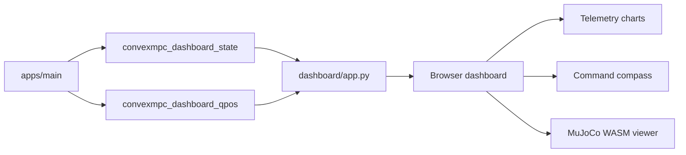

# Web Dashboard

The web dashboard combines the controller telemetry plots with a lightweight
MuJoCo WASM viewer. It is intended for the normal headless workflow:

1. run `apps/main` without the native MuJoCo viewer,
2. publish telemetry and `qpos` through shared memory,
3. render the robot and plots in a browser.

The result is a single local page with:

- a MuJoCo scene viewer for the MIT humanoid,
- visual/collision geometry toggles,
- a filtered-command compass for `x_dot`, `y_dot`, and `psi_dot`,
- draggable and resizable main charts,
- the full telemetry chart grid below the main panels.

## Requirements

The C++ side has the same requirements as the rest of the project:

- CMake 3.16 or newer
- a C++17 compiler
- `vcpkg`
- a local MuJoCo installation

The browser dashboard additionally needs:

- Python 3.9 or newer
- Node.js and npm
- the JavaScript dependencies under `web_viewer/`

Install the web dependencies once:

```bash
cd web_viewer
npm install
cd ..
```

The dashboard server is plain Python and does not require a web framework. It
uses the standard library HTTP server plus the browser-side `mujoco-js` and
`three` packages installed by npm.

## Recommended Run Path

Build the controller first:

```bash
cmake --preset dev
cmake --build --preset dev -j
```

Launch the MIT humanoid headless with the integrated web dashboard and viewer:

```bash
./scripts/launch_convexmpc.sh --web-viewer m n
```

The launcher starts:

- `build/apps/main m n`
- `dashboard/app.py` on the first free port at or above `8001`

When `--web-viewer` is used with the dashboard enabled, the MuJoCo WASM viewer is
embedded into the dashboard instead of starting a second standalone viewer
process.

Useful environment variables:

| Variable | Default | Meaning |
| --- | --- | --- |
| `CONVEXMPC_DASHBOARD_PORT` | `8001` | First dashboard port to try |
| `CONVEXMPC_DASHBOARD_OPEN_BROWSER` | `1` | Open the browser automatically when supported |
| `CONVEXMPC_DASHBOARD_QPOS_HZ` | `60` | `qpos` publish rate used by the C++ side |
| `CONVEXMPC_SHM_NAME` | `convexmpc_dashboard_state` | Telemetry shared-memory name |
| `CONVEXMPC_QPOS_SHM_NAME` | `convexmpc_dashboard_qpos` | `qpos` shared-memory name |
| `CONVEXMPC_HEADLESS_REALTIME` | set by launcher for `--web-viewer ... n` | Throttle headless simulation to wall time |

For a fixed port without opening a browser:

```bash
CONVEXMPC_DASHBOARD_OPEN_BROWSER=0 \
CONVEXMPC_DASHBOARD_PORT=8015 \
./scripts/launch_convexmpc.sh --web-viewer m n
```

Then open:

```text
http://127.0.0.1:8015
```

## Standalone Viewer

The standalone viewer remains available for viewer-only experiments:

```bash
./scripts/launch_convexmpc.sh --no-dashboard --web-viewer m n
```

This starts `web_viewer/app.py` instead of `dashboard/app.py`. The standalone
page is useful when you want a fullscreen render target with no telemetry UI.

For a zero-command spawn test:

```bash
cmake --build build --target main_zero -j
./scripts/launch_convexmpc.sh --zero-command --no-dashboard --web-viewer m n
```

## Data Flow

Two shared-memory streams feed the page.



The telemetry stream contains the compact state vector used by the plots:

$$
x_{\text{dash}} =
\begin{bmatrix}
\phi & \theta & \psi &
p_x & p_y & p_z &
\omega_x & \omega_y & \omega_z &
v_x & v_y & v_z &
\dot x_{\text{cmd}} & \dot y_{\text{cmd}} & \dot\psi_{\text{cmd}} &
\phi_{\text{target}} & \theta_{\text{target}} & z_{\text{target}}
\end{bmatrix}^\top .
$$

The first twelve entries are plotted as state channels. The last six entries are
overlay channels:

- command overlays on `vel_x`, `vel_y`, and `omega_z`,
- target overlays on `roll`, `pitch`, and `pos_z`.

The `qpos` stream is separate because the viewer only needs generalized
coordinates:

$$
q(t) = \texttt{qpos}(t) \in \mathbb{R}^{n_q}.
$$

On each new sample, the browser copies `q(t)` into the MuJoCo WASM `MjData`,
runs:

```text
mj_forward(model, data)
```

and updates the Three.js meshes from MuJoCo's computed geometry poses.

## Viewer Implementation

The viewer loads the checked-in MIT humanoid scene through the browser:

- `dashboard/app.py` serves `/api/model-files`,
- XML and STL files are exposed under `/model/mit_humanoid/...`,
- `viewer.js` writes those files into the MuJoCo WASM filesystem,
- `MjModel.loadFromXML("/working/scene.xml")` compiles the scene.

The dashboard therefore uses the real `scene.xml` model and kinematics. Rendering
is still a Three.js renderer, not MuJoCo's native renderer, so lighting,
reflection, and texture appearance are approximations. The floor checker texture
is reconstructed from the XML texture/material attributes, while visual and
collision geometry come from the compiled MuJoCo model.

Geometry groups are interpreted as:

| MuJoCo group | Dashboard use |
| ---: | --- |
| `1` | visual robot geometry |
| `2` | floor / scene geometry |
| `3` | collision robot geometry |
| `4` | debug geometry, hidden by default |

The `Visual` and `Collision` buttons rebuild the displayed geometry set without
reloading the model. Collision geometry uses a higher display alpha in the web
viewer so that it remains visible on top of the visual model; the XML itself is
not modified.

## Command Compass

The compass visualizes the filtered command components:

$$
u_{\text{cmd}} =
\begin{bmatrix}
\dot x_{\text{cmd}} &
\dot y_{\text{cmd}} &
\dot\psi_{\text{cmd}}
\end{bmatrix}^\top .
$$

The central arrow shows planar command velocity. Its length is normalized by the
current walking command scale:

$$
\ell =
\operatorname{clip}\left(
\frac{\sqrt{\dot x_{\text{cmd}}^2 + \dot y_{\text{cmd}}^2}}{0.7},
0,
1
\right).
$$

The outer arc shows the commanded yaw rate. Numeric readouts below the compass
show `x_dot`, `y_dot`, and `psi_dot` using the dashboard's selected angular unit.

## Main Chart Layout

The dashboard starts with three main charts in the first row:

| Panel | Default channel |
| ---: | --- |
| 1 | `Vel X` |
| 2 | `Vel Y` |
| 3 | `Omega Z` |

Each main chart can be resized from the lower-right corner. A chart can also be
dragged by its header:

- drop it on an existing row to place it beside other charts,
- drop it between rows to create a new row,
- leave a row empty and it disappears automatically.

The layout is stored in browser `localStorage`, so user adjustments persist
across page reloads. If the default layout changes in the code, the storage key
version is bumped so old layouts do not override new defaults.

## Endpoints

`dashboard/app.py` serves both telemetry and viewer resources:

| Endpoint | Purpose |
| --- | --- |
| `/` | Dashboard HTML |
| `/api/state` | Latest telemetry state snapshot |
| `/api/qpos` | Latest `qpos` snapshot |
| `/events/qpos` | Server-sent `qpos` stream at about 60 Hz |
| `/api/model-files` | MIT humanoid XML/STL manifest |
| `/model/mit_humanoid/...` | Model XML and mesh assets |
| `/node_modules/...` | Browser-side npm dependencies |

## Troubleshooting

If the page loads but the viewer stays in a waiting state:

1. confirm the controller is still running,
2. confirm the launcher printed the same `CONVEXMPC_QPOS_SHM_NAME` for both main
   and dashboard,
3. restart through `scripts/launch_convexmpc.sh` so stale shared-memory segments
   are cleared before launch.

If the browser page opens but MuJoCo WASM fails to load, run:

```bash
cd web_viewer
npm install
```

If headless simulation runs too fast for the browser, launch with `--web-viewer`.
The launcher sets `CONVEXMPC_HEADLESS_REALTIME=1` for headless viewer runs unless
the variable is already set.
